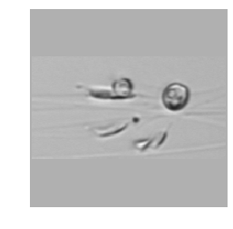
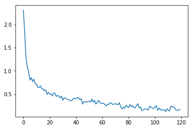
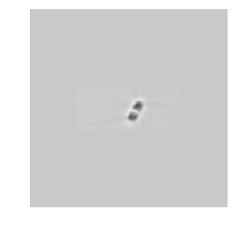
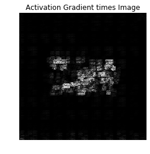
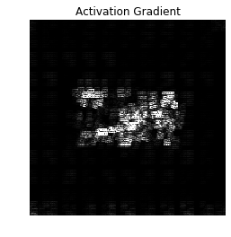

# Identifying Types of Plankton with Machine Learning

## What is this?
We developed a machine learning model that identifies the kind of plankton displayed in an image. To train our convolutional neural network, we used a dataset of over 200,000 images of 65 kinds of plankton, which we got from the Woods Hole Oceanographic Institute's Open Access Server. The dataset can be found [here](https://darchive.mblwhoilibrary.org/handle/1912/7341).

## Why does it matter?
About 80 percent of the world's oxygen is produced by plankton [source: EOS](https://eos.org/research-spotlights/worlds-biggest-oxygen-producers-living-in-swirling-ocean-waters). This means plankton is at the center of many climate change researchers' projects of how to reduce carbon in the earth's atmosphere. Understanding what kinds of plankton appear in different parts of the world at various times of the year could contribute to this important research.

## Important considerations
Every model has limitations. Here are a few important ones to acknowledge before we get into how it works:
- The images we used were all collected in the same location (by Martha's Vineyard, MA, USA).
- The data is organized by year and we only used one year (2014, the most recent).
- In the original dataset, the images are all different sizes, and variations in image dimensions are often correlated with the type of plankton in the image. While we did do some [preprocessing](#preprocessing) in order to make all the images the same size without changing their aspect ratios, we saw through our [visualization of a layer](#visualizing-an-activation-gradient) that the model still seems to pick up on the original size difference. This means it may be doing its classifications based in part on correlations within the image dimensions, instead of purely what’s in the image.

## How does it work?

#### Preprocessing
First we spent some time exploring and preprocessing the dataset. We found that the data is organized by year and then by category within year. To downsample the data, we chose to start with the most recent dataset, which was from 2014, and selected the 9 categories of plankton with the most images to make our model as strong as possible. 

Next we needed to give all the chosen images the same dimensions without changing their aspect ratios. To do this, we averaged the RGB color values within each image and created a background of this averaged greyish color that surrounded the original image and made the new image 200x200 pixels. Now we’re ready to rock!

##### *Example of a post-preprocessed image of a plankton.*

#### Convolutional Neural Network
In our model, we take the preprocessed data and randomly differentiate it into training and testing data. From this, we use the training data through a size 2 pool and a size 5 pool to reduce the dimensionality of our connected layers. We then use three convolutional kernels to create three convolutional layers. We then fully connect these layers and result with a setup CNN ready to be run. To begin calling the CNN, we collect a sampler of the data, zero the gradient, and compute the outputs of the neural net, running our forward pass. We use this forward pass to create a loss and backward propogate these losses through the system. Finally we take a step. This is done in batches of 32 images. 300 batches are run per epoch and 8 epochs are run in total.

#### Analyzing Our Success
In the development of our neural net, we managed to obtain an 87% accuracy on the testing set for the 9 categories of plankton in less than 400 seconds, down from from around 900 seconds. To do this we utilized caching our image folders and drawing to eliminate time spent pulling the data from a pytorch ImageFolder. Through looking into the validation loss between the epochs, we determined that we could stop the training at 5 epochs. Additional training does not seem to decrease the accuracy of our testing data however. Below is our training losses over the total of 8 epochs.

##### *Visualization of our training losses over 8 epochs.*

#### Visualizing an Activation Gradient
In order to get a snapshot of our model at work, we decided to create a visualization. Here we extracted the primary layer of the sample image and compare the activation gradient, the original image, and the activation gradient times the image. As mentioned in the [important considerations section](#important-considerations), this visualization illuminated how the model picked up on the original dimensions of the images, rendering our preprocessing potentially less impactful than we had hoped. There is a possible next step here, discussed in the next section. 

  
##### *Example image, activation gradient times the image, and the activation gradient.*

## Possible Next Steps
- Expanding to more categories of plankton (right now we're only working with 9, but there are over 50 types cataloged in the 2014 dataset alone). This would be more challenging because we chose to work with the plankton with the most images (at least 1000) but many categories of plankton had orders of magnitude less than that.
- Expanding to additional year's datasets (we worked with 2014 and expanded to 2013, but there are datasets dating back to 2006)
- If there were timestamps on the data, it could be interesting to analyze how types of plankton vary seasonally
